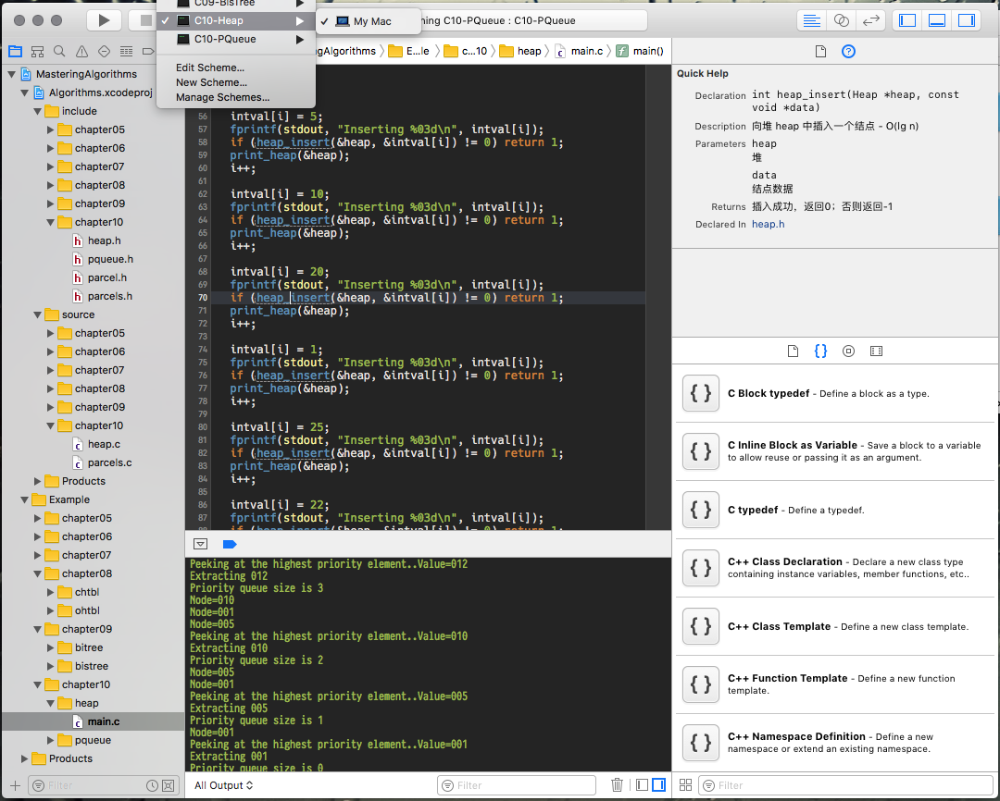

# 《算法精解：C语言描述》源码及Xcode工程、Linux工程

Mac 下使用 Xcode 打开 `MasteringAlgorithms.xcodeproj` 即可。`Algorithms.xcodeproj` 为算法库文件工程。每个 Example 都是单独的运行文件。

## Mac 或者 Linux 命令行

只需要有简单的 c 编译环境`cc`

然后执行 `./run bfs`，其中 `bfs` 为 `Example` 中的示例目录。

也可以自己使用`cc` `gcc` 等，`gcc source/*.c Example/bfs/main.c -I ./include -o bfs && ./bfs`

## 数据结构

### 链表

- [单链表](source/list.c)
- [页帧管理](source/frames.c)
- [双向链表](source/dlist.c)
- [循环链表](source/clist.c)
- [第二次机会页面置换](source/page.c)

### 栈和队列

- [栈](source/stack.c)
- [队列](source/queue.c)
- [事件处理](source/events.c)

### 集合

- [集合](source/set.c)
- [集合覆盖](source/cover.c)

### 哈希表

- [链式哈希表](source/chtbl.c)
- [符号表](source/lex.c)
- [开地址哈希表](source/ohtbl.c)

### 树

- [二叉树](source/bitree.c)
- [二叉树遍历](source/traverse.c)
- [二叉搜索树](source/bistree.c)

### 堆和优先队列

- [堆](source/heap.c)
- [优先队列](include/pqueue.h)
- [包裹分拣](source/parcels.c)

### 图

- [图](source/graph.c)
- [图的深度搜索](source/dfs.c)
- [图的广度搜索](source/bfs.c)

## 算法

### 排序和搜索

- [插入排序](source/issort.c)
- [快速排序](source/qksort.c) 
- [目录列表](source/directls.c)
- [归并排序](source/mgsort.c)
- [计数排序](source/ctsort.c)
- [基数排序](source/rxsort.c)
- [二分查找](source/bisearch.c)
- [拼写检查器](source/spell.c)

### 数值计算

- [多项式插值法](source/interpol.c)
- [最小二乘估计法](source/lsqe.c)
- [方程求解](source/root.c)

### 数据压缩

- [位操作](source/bit.c)
- [霍夫曼编码](source/huffman.c)
- [网络传输优化](source/transfer.c)
- [LZ77](source/lz77.c)

### 数据加密

- [DES算法](source/des.c)
- [分组加密模式](source/cbc.c)
- [RSA算法](source/rsa.c)

### 图算法

- [最小生成树](source/mst.c) 
- [最短路径](source/shortest.c)
- [最短距离路由](source/route.c)
- [旅行商问题](source/tsp.c)

### 几何算法

- [测试线段是否相交](source/lint.c)
- [凸包计算](source/cvxhull.c)
- [球面弧长](source/arclen.c)
- [地球上两点之间的近似距离](source/geodist.c)

